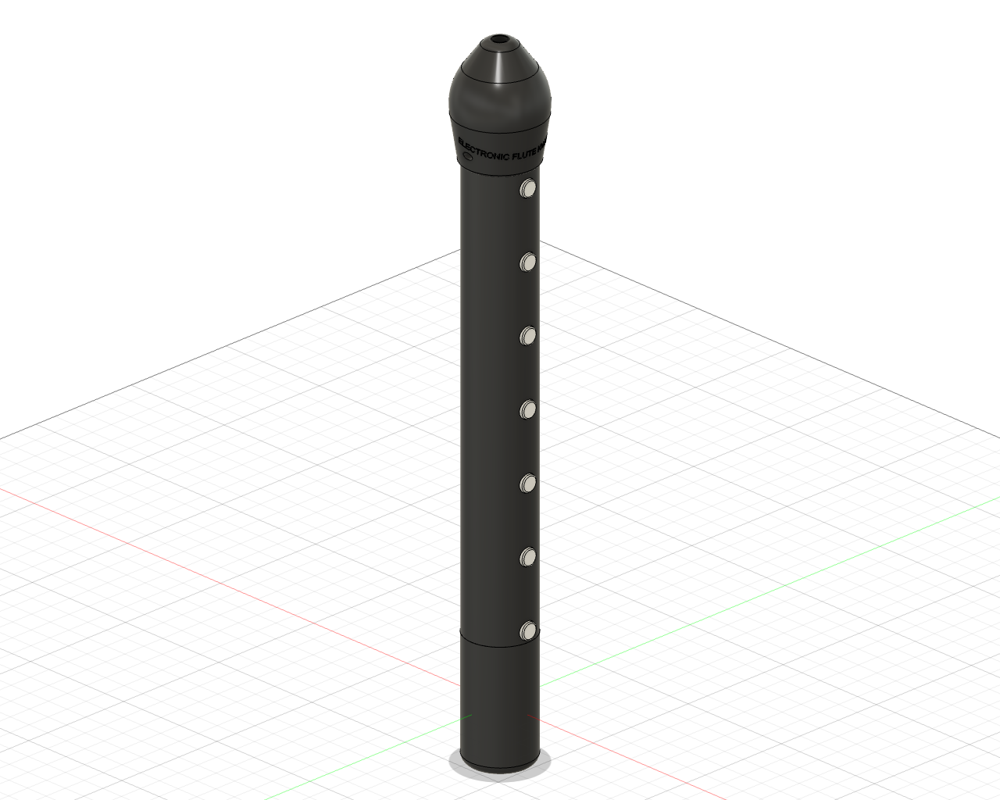
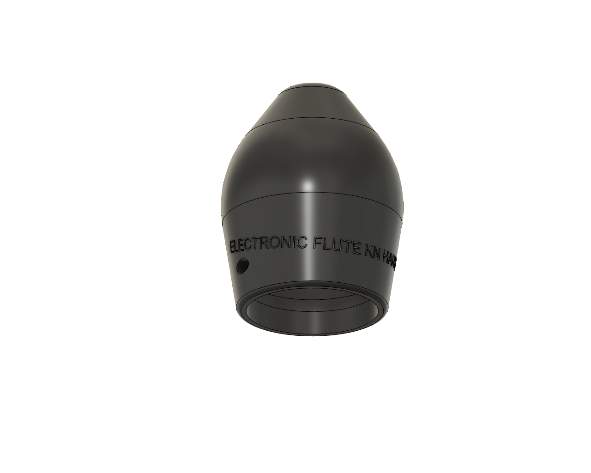
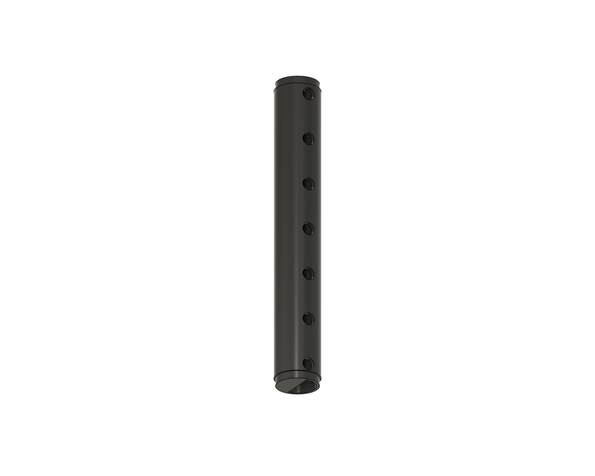
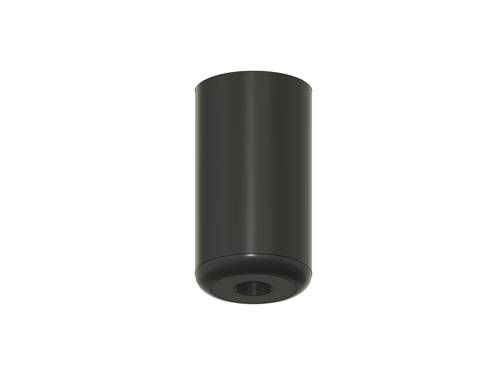
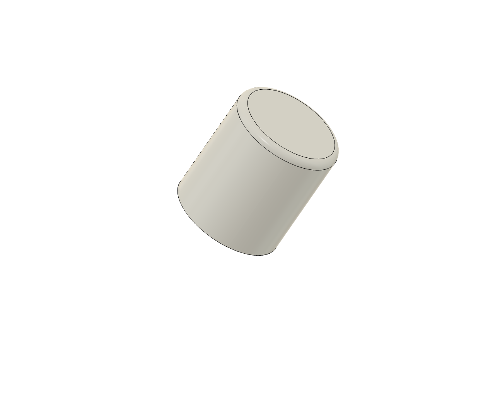
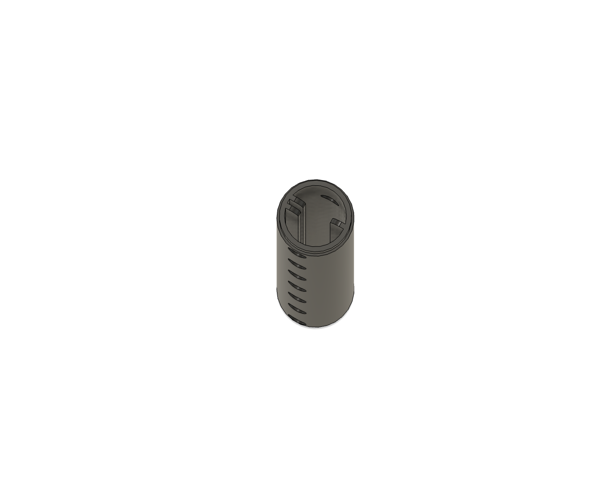
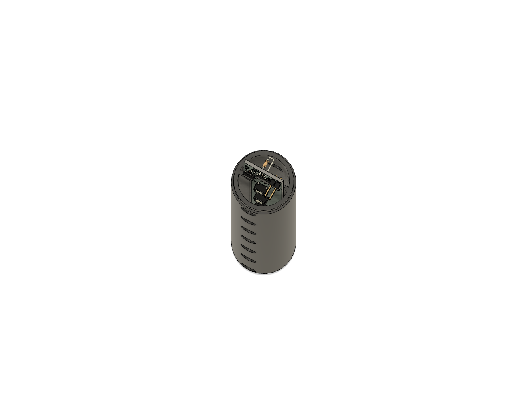

# Flute Enclosure

This directory contains the 3D models and manufacturing files required to print the flute enclosure. The design consists of three main interconnecting body segments (top, middle, and bottom) and individual button caps.

## Visual Overview

**Full Assembly**

**Individual Components**

**Internal Details**

## Files

### Print-Ready Files (`/stl`)
Drop these directly into your slicer software.
* `top.stl`
* `mid.stl`
* `bottom.stl`
* `button.stl` *(Note: You must print 8 copies of this file)*

### Source Files (`/source`)
Use these files if you want to modify or remix the design.
* `flute_hardwire.f3z`: Native Fusion 360 archive containing the full design history.
* `flute_hardwire.step`: Universal solid model format, compatible with most CAD software.

## Printing Guidelines

* **Material:** Standard PLA
* **Layer Height:** 0.2mm (Standard)
* **Infill:** 15% - 20% (Standard)
* **Supports:** Recommended for all parts. It is theoretically possible to print without them, but supports were used for the successful prototype.
* **Orientation Notes:** Print the 8 button caps upside down. 

## Assembly Instructions

Please follow this specific order to ensure the electronics fit properly into the enclosure:

1. **Pre-solder PCB Wires:** Solder the two wires meant for the audio jack onto the PCB first. **Do not** solder the audio jack to the wires yet.
2. **Insert PCB:** Carefully slide the PCB into the internal guide slots of the middle enclosure part.
3. **Solder Audio Jack:** With the PCB seated in the slots, solder the audio jack to the two wires.
4. **Connect Enclosure:** Interconnect the top, middle, and bottom enclosure segments by sliding them together. 
5. **Install Buttons:** Slide the 8 printed button caps into the external holes on the middle segment. Push them in until they click securely onto the tactile buttons on the PCB.